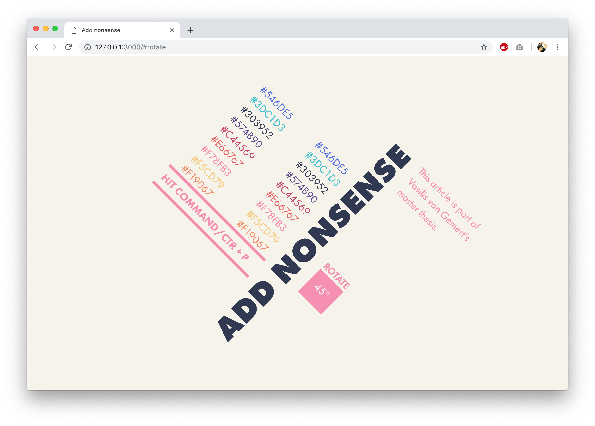

**CSS to the Rescue @cmda-minor-web 18-19**

# Add Nonsense

The article Add Nonsense is part of Vasilis van Gemert’s master thesis. On this website users can print this article by hitting command/ctrl +p. By choosing different colors the user can "costumize" the printed version of the article.

