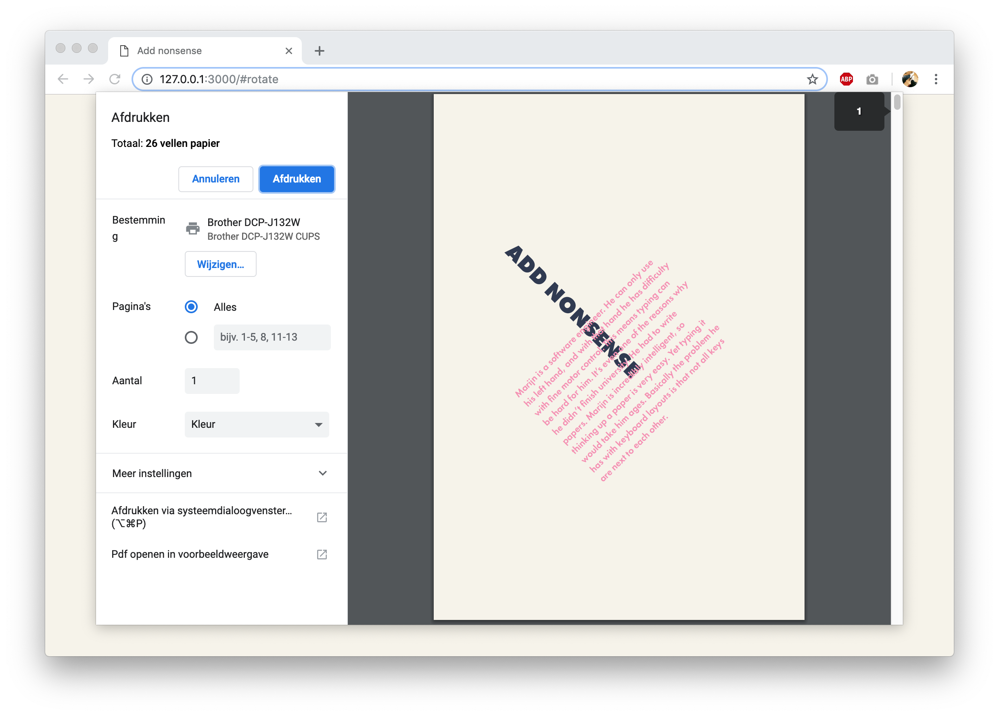

**CSS to the Rescue @cmda-minor-web 18-19**

# Add Nonsense

The article [Add Nonsense](https://exclusive-design.vasilis.nl/add-nonsense/) is part of Vasilis van Gemert’s master thesis. On this website users can print this article by hitting `command/ctrl +p`. By choosing different colors the user can _costumize_ the printed version of the article.

## Smacss

## Restrictions

- [x] Two Colors
- [] ?
